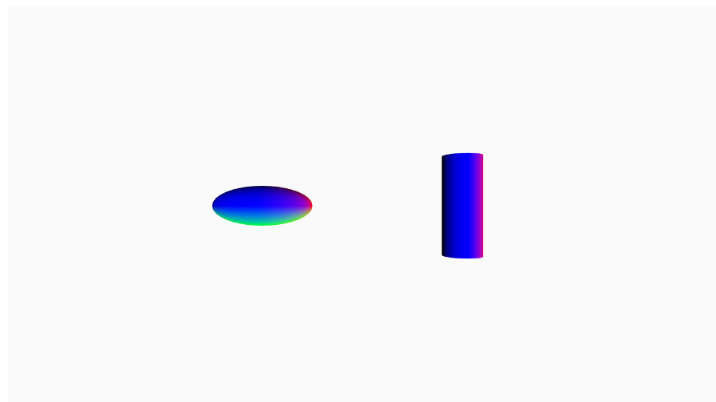
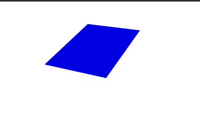
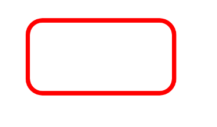

# web503-lab-three-josh-moss

```markdown
This week in web503 for labs three, we had a set of tasks to complete using the p5.js library of functions.
Some things I learnt this lab were, how to create 3d objects using WEBGL, how to create certain shapes using
the shapes command function and resizing it on the canvas and manipulating its location with the translate 
function.

I have had quite a lot of time playing around with p5 in my own time which helped me with this lab. 
Below I have added some screenshots of the final outcome of my functions.

```

 <br />
 <br />
 <br />
